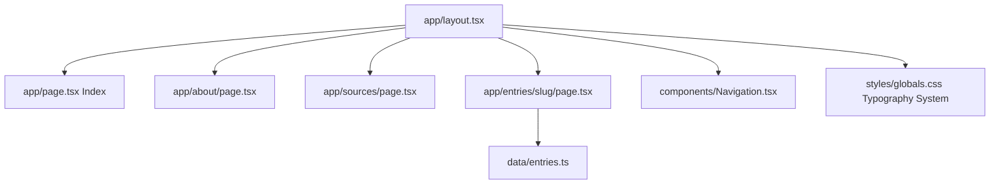

# Arabic Typography Microsite

## Architecture

A Next.js 14+ App Router application with three core pages and a dynamic entry template. The site prioritizes typography as interface, with no decoration, animations, or unnecessary interaction.



---

## File Structure

```
app/
├── layout.tsx              # Root layout with Navigation
├── page.tsx                # Index (Card Grid)
├── about/
│   └── page.tsx            # About page
├── sources/
│   └── page.tsx            # Sources page
└── entries/
    └── [slug]/
        └── page.tsx        # Dynamic entry template

components/
├── Navigation.tsx          # Top nav (Index, About, Sources)
├── EntryCard.tsx           # Individual card component
├── ArabicDisplay.tsx       # Arabic text display
├── Comparison.tsx          # Side-by-side comparison
└── LetterForms.tsx         # Letter form display

data/
└── entries.ts              # Entry data + related links

styles/
└── globals.css             # Typography system
```

---

## Page Routes

| Route                            | File                           | Purpose                |
|----------------------------------|--------------------------------|------------------------|
| `/`                              | `app/page.tsx`                 | Card Encyclopedia Grid |
| `/about`                         | `app/about/page.tsx`           | About the project      |
| `/sources`                       | `app/sources/page.tsx`         | Bibliography           |
| `/entries/[slug]`                | `app/entries/[slug]/page.tsx`  | Dynamic entry page     |

---

## Entry Pages (14 total)

| Route                              | Display Title           |
|------------------------------------|-------------------------|
| `/entries/rtl`                     | RTL                     |
| `/entries/numbers-in-arabic-text`  | Numbers in Arabic Text  |
| `/entries/diacritics`              | Diacritics              |
| `/entries/contextual-letterforms`  | Contextual Letterforms  |
| `/entries/kashida`                 | Kashida                 |
| `/entries/tooth`                   | Tooth                   |
| `/entries/dot-placement`           | Dot Placement           |
| `/entries/naskh`                   | Naskh                   |
| `/entries/ruqah`                   | Ruqʿah                  |
| `/entries/thuluth`                 | Thuluth                 |
| `/entries/nastaliq`                | Nastaʿliq               |
| `/entries/diwani`                  | Diwani                  |
| `/entries/kufi`                    | Kufi                    |
| `/entries/maghrebi`                | Maghrebi                |

---

## Navigation Flow

```mermaid
flowchart TD
    TopNav[Top Nav: Index / About / Sources]
    TopNav --> IndexPage[/ Index with 14 cards]
    TopNav --> AboutPage[/about]
    TopNav --> SourcesPage[/sources]
    IndexPage -->|card click| EntryPage[/entries/slug]
    EntryPage -->|related links| EntryPage
```

**Rules:**
- Top nav accessible from every page
- Index is the central hub with 14 card grid
- Entry pages interconnect via Related entries (3-6 links each)

---

## Related Entries Map

Each entry page displays 3-6 related links.

| Entry                      | Related Entries                                                |
|----------------------------|----------------------------------------------------------------|
| RTL                        | Numbers in Arabic Text, Contextual Letterforms, Diacritics, Kashida |
| Numbers in Arabic Text     | RTL, Naskh, Ruqʿah                                             |
| Diacritics                 | Dot Placement, Contextual Letterforms, Naskh, Thuluth          |
| Contextual Letterforms     | RTL, Tooth, Dot Placement, Naskh, Ruqʿah                       |
| Kashida                    | RTL, Tooth, Naskh, Ruqʿah                                      |
| Tooth                      | Contextual Letterforms, Kashida, Naskh, Ruqʿah                 |
| Dot Placement              | Diacritics, Contextual Letterforms, Naskh, Maghrebi            |
| Naskh                      | Ruqʿah, Thuluth, Diacritics, Contextual Letterforms, Kashida   |
| Ruqʿah                     | Naskh, Tooth, Kashida, Contextual Letterforms                  |
| Thuluth                    | Naskh, Diacritics, Diwani                                      |
| Nastaʿliq                  | Contextual Letterforms, Diacritics, Kufi                       |
| Diwani                     | Thuluth, Diacritics, Kashida                                   |
| Kufi                       | Maghrebi, Diacritics, Dot Placement                            |
| Maghrebi                   | Kufi, Dot Placement, Diacritics                                |

---

## Bidirectional Link Reference

Reverse lookup — who links TO each entry:

| Entry                    | Linked FROM                                                              |
|--------------------------|--------------------------------------------------------------------------|
| RTL                      | Numbers in Arabic Text, Contextual Letterforms, Kashida                  |
| Numbers in Arabic Text   | RTL                                                                      |
| Diacritics               | RTL, Dot Placement, Naskh, Thuluth, Nastaʿliq, Diwani, Kufi, Maghrebi    |
| Contextual Letterforms   | RTL, Diacritics, Tooth, Kashida, Naskh, Ruqʿah, Nastaʿliq                |
| Kashida                  | RTL, Tooth, Naskh, Ruqʿah, Diwani                                        |
| Tooth                    | Contextual Letterforms, Kashida, Ruqʿah                                  |
| Dot Placement            | Diacritics, Contextual Letterforms, Kufi, Maghrebi                       |
| Naskh                    | Numbers in Arabic Text, Diacritics, Contextual Letterforms, Kashida, Tooth, Dot Placement, Ruqʿah, Thuluth |
| Ruqʿah                   | Numbers in Arabic Text, Contextual Letterforms, Kashida, Tooth, Naskh    |
| Thuluth                  | Diacritics, Naskh, Diwani                                                |
| Nastaʿliq                | —                                                                        |
| Diwani                   | Thuluth                                                                  |
| Kufi                     | Nastaʿliq, Maghrebi                                                      |
| Maghrebi                 | Dot Placement, Kufi                                                      |

---

## Data Structure

```typescript
// data/entries.ts

export interface Entry {
  slug: string;
  title: string;
  related: string[];
}

export const entries: Entry[] = [
  {
    slug: "rtl",
    title: "RTL",
    related: ["numbers-in-arabic-text", "contextual-letterforms", "diacritics", "kashida"]
  },
  {
    slug: "numbers-in-arabic-text",
    title: "Numbers in Arabic Text",
    related: ["rtl", "naskh", "ruqah"]
  },
  {
    slug: "diacritics",
    title: "Diacritics",
    related: ["dot-placement", "contextual-letterforms", "naskh", "thuluth"]
  },
  {
    slug: "contextual-letterforms",
    title: "Contextual Letterforms",
    related: ["rtl", "tooth", "dot-placement", "naskh", "ruqah"]
  },
  {
    slug: "kashida",
    title: "Kashida",
    related: ["rtl", "tooth", "naskh", "ruqah"]
  },
  {
    slug: "tooth",
    title: "Tooth",
    related: ["contextual-letterforms", "kashida", "naskh", "ruqah"]
  },
  {
    slug: "dot-placement",
    title: "Dot Placement",
    related: ["diacritics", "contextual-letterforms", "naskh", "maghrebi"]
  },
  {
    slug: "naskh",
    title: "Naskh",
    related: ["ruqah", "thuluth", "diacritics", "contextual-letterforms", "kashida"]
  },
  {
    slug: "ruqah",
    title: "Ruqʿah",
    related: ["naskh", "tooth", "kashida", "contextual-letterforms"]
  },
  {
    slug: "thuluth",
    title: "Thuluth",
    related: ["naskh", "diacritics", "diwani"]
  },
  {
    slug: "nastaliq",
    title: "Nastaʿliq",
    related: ["contextual-letterforms", "diacritics", "kufi"]
  },
  {
    slug: "diwani",
    title: "Diwani",
    related: ["thuluth", "diacritics", "kashida"]
  },
  {
    slug: "kufi",
    title: "Kufi",
    related: ["maghrebi", "diacritics", "dot-placement"]
  },
  {
    slug: "maghrebi",
    title: "Maghrebi",
    related: ["kufi", "dot-placement", "diacritics"]
  }
];
```

---

## Index Page Behavior

The index page (`/`) displays all 14 entries in a grid layout.

- Card click navigates to `/entries/[slug]`
- Optional: Search (title-only)
- Optional: Filter UI (for browsing convenience only, no URL hierarchy)

---

## Summary

| Metric                  | Value |
|-------------------------|-------|
| Total pages             | 17    |
| Top-level pages         | 3     |
| Entry pages             | 14    |
| Total related links     | 52    |
| Avg related links/entry | 3.7   |
